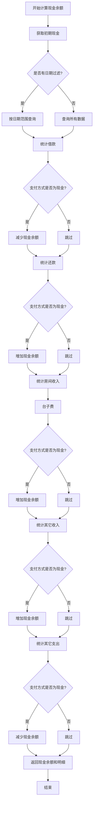

# 现金相关逻辑图表

## 现金余额计算逻辑

### 现金余额计算公式

```
现金余额 = 初期现金 
         + 还款（现金支付）
         + 房间收入（现金支付：仅台子费，因为台子费已包含商品消费和餐费）
         + 其它收入（现金支付）
         - 借款（现金支付）
         - 其它支出（现金支付）
```

**重要说明**：
- 台子费已经包含了商品消费和餐费，所以只统计台子费，不重复统计商品消费和餐费
- 商品消费和餐费的 `payment_method` 字段仅用于记录，不参与现金余额计算

## 现金相关代码位置

### 1. 后端API - 支付方式统计
**文件**: `backend/app/api/payment_statistics.py`

**功能**: 计算现金余额和明细

**关键逻辑**:
- 从系统配置获取初期现金 (`initial_cash`)
- 统计借款（减少现金）
- 统计还款（增加现金）
- 统计房间收入（仅台子费，因为台子费已包含商品消费和餐费，增加现金）
- 统计其它收入（增加现金）
- 统计其它支出（减少现金）

**注意**：商品消费和餐费不单独统计，因为它们已包含在台子费中

### 2. 前端页面 - 现金余额显示

#### 首页 (`src/views/index/index.vue`)
- **位置**: 统计卡片区域
- **显示**: 现金余额（替换了"今日开台次数"）
- **数据来源**: `getPaymentStatistics` API
- **更新频率**: 页面加载时和自动刷新时

#### 支付方式统计页面 (`src/views/statistics/payment-method.vue`)
- **位置**: 统计卡片和明细表格
- **显示**: 现金总额、初期现金、现金明细（借款、还款、房间收入、其它收入、其它支出）

#### 初期现金设置页面 (`src/views/settings/initial-cash.vue`)
- **位置**: 系统设置
- **功能**: 设置系统初始现金余额

### 3. 现金支付方式使用位置

#### 房间会话页面 (`src/views/room/session.vue`)
- **借款**: `loanForm.payment_method` (默认: "现金")
- **商品消费**: `productForm.payment_method` (默认: "现金")
- **餐费**: `mealForm.payment_method` (默认: "现金")
- **台子费**: `tableFeeForm.payment_method` (默认: "现金")
- **结算房间**: 
  - `settleForm.table_fee_payment_method` (默认: "现金")
  - `settleForm.repaymentMethods` (默认: "现金")
  - 商品和餐费的 `payment_method` (默认: "现金")

#### 客户管理页面 (`src/views/customer/list.vue`)
- **还款**: `repaymentForm.payment_method` (默认: "现金")

#### 其它收入/支出页面
- **其它收入**: `src/views/settings/other-income.vue` (默认: "现金")
- **其它支出**: `src/views/settings/other-expense.vue` (默认: "现金")

## 现金余额计算流程图



## 现金余额影响因素

### 增加现金余额的操作
1. **还款** (`CustomerRepayment`)
   - 支付方式为"现金"时增加
   - 金额为正数时增加
   - 金额为负数时减少（退款）

2. **房间收入** (`RoomSession`)
   - **台子费**: `table_fee_payment_method = "现金"`
   - **注意**: 商品消费和餐费不单独统计，因为它们已包含在台子费中
   - 商品消费和餐费的 `payment_method` 字段仅用于记录，不参与现金余额计算

3. **其它收入** (`OtherIncome`)
   - `payment_method = "现金"`

### 减少现金余额的操作
1. **借款** (`CustomerLoan`)
   - `payment_method = "现金"` 时减少

2. **其它支出** (`OtherExpense`)
   - `payment_method = "现金"` 时减少

## 现金相关数据模型

### 1. 系统配置 (`SystemConfig`)
- **键**: `initial_cash`
- **值**: 初期现金余额（字符串格式的Decimal）
- **用途**: 现金余额计算的起始值

### 2. 客户借款 (`CustomerLoan`)
- **字段**: `payment_method` (默认: "现金")
- **影响**: 如果为"现金"，减少现金余额

### 3. 客户还款 (`CustomerRepayment`)
- **字段**: `payment_method` (默认: "现金")
- **影响**: 如果为"现金"，增加现金余额（正数）或减少（负数退款）

### 4. 房间会话 (`RoomSession`)
- **字段**: `table_fee_payment_method` (默认: "现金")
- **影响**: 如果为"现金"，增加现金余额

### 5. 商品消费 (`ProductConsumption`)
- **字段**: `payment_method` (默认: "现金")
- **影响**: 如果为"现金"，增加现金余额

### 6. 餐费记录 (`MealRecord`)
- **字段**: `payment_method` (默认: "现金")
- **影响**: 如果为"现金"，增加现金余额

### 7. 其它收入 (`OtherIncome`)
- **字段**: `payment_method` (默认: "现金")
- **影响**: 如果为"现金"，增加现金余额

### 8. 其它支出 (`OtherExpense`)
- **字段**: `payment_method` (默认: "现金")
- **影响**: 如果为"现金"，减少现金余额

## 现金余额更新时机

1. **实时更新**: 
   - 每次借款、还款、房间结算、其它收入/支出操作后
   - 通过 `getPaymentStatistics` API 重新计算

2. **页面加载时**:
   - 首页加载时获取今日现金余额
   - 支付方式统计页面加载时获取现金总额和明细

3. **自动刷新**:
   - 首页有自动刷新机制，定期更新统计数据（包括现金余额）

## 现金相关API接口

### 1. 获取支付方式统计
- **接口**: `GET /api/payment-statistics`
- **参数**: 
  - `start_date` (可选): 开始日期
  - `end_date` (可选): 结束日期
- **返回**: 
  - `cash_total`: 现金总额
  - `initial_cash`: 初期现金
  - `cash_breakdown`: 现金明细（借款、还款、房间收入、其它收入、其它支出）

### 2. 设置初期现金
- **接口**: `PUT /api/system-config/initial_cash`
- **参数**: `value`: 初期现金金额
- **用途**: 设置系统初始现金余额

## 现金相关前端组件

### 1. 支付方式选择器
**位置**: 多个页面
**选项**: 
- 现金
- 微信
- 支付宝
- 转账
**默认值**: "现金"

### 2. 现金余额显示卡片
**位置**: 首页统计卡片区域
**样式**: 绿色渐变背景
**图标**: Wallet（钱包图标）
**显示格式**: ¥金额（保留2位小数）

### 3. 现金明细表格
**位置**: 支付方式统计页面
**显示内容**:
- 借款（红色，负数）
- 还款（绿色，正数）
- 房间收入（绿色，正数）
- 其它收入（绿色，正数）
- 其它支出（红色，负数）

## 注意事项

1. **现金余额计算**:
   - 基于所有历史数据计算
   - 支持按日期范围过滤
   - 不包含未结算的房间会话

2. **默认支付方式**:
   - 所有涉及支付的操作，默认支付方式都是"现金"
   - 用户可以在界面上选择其他支付方式

3. **数据一致性**:
   - 现金余额是实时计算的，不存储在数据库中
   - 每次查询都会重新计算，确保数据准确性

4. **负数处理**:
   - 还款金额可以为负数（表示退款）
   - 负数还款会减少现金余额

